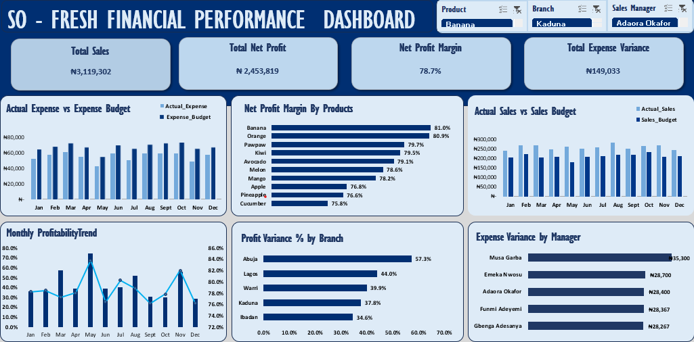

# So-Fresh: Sales and Profitability Variance Analysis

An executive financial dashboard and variance analysis that evaluates portfolio efficiency, budget accuracy, and regional operations across 5 branches and 10 product lines.

---

## Business Objective

So Fresh had strong total revenue, but the overall numbers hid serious operational problems, localized losses, and mid-year cost spikes. This project combines separate sales and expense data into one central data model. It delivers an interactive Excel dashboard and a strategic presentation deck (`So-Fresh-Financial-Analysis.pdf`) to identify profit leaks and give management clear, evidence-based cost-control steps.
**[Click Here to View the Executive Presentation Deck (PDF)](So-Fresh-Financial-Analysis.pdf)**
---

## Core Financial Performance (Fiscal Year)

| KPI | Budget | Actual | Variance |
|-----|--------|--------|----------|
| Total Revenue | ₦2,536,000 | ₦3,119,302 | +23.0% |
| Operating Expenses | ₦814,517 | ₦665,483 | +₦149,034 favorable |
| Net Profit | ₦1,721,483 | ₦2,453,819 | +42.5% |
| Net Margin | — | 78.7% | — |

### Interactive Financial Dashboard Preview

---

## Key Analytical Insights

### 1. The Aggregate Illusion
* Strong overall profitability hides 15 localized product-branch net loss combinations. 
* Pineapple and Cucumber lose money in specific branches despite meeting or exceeding their sales volume targets.

### 2. High Margin Volatility Within a Single Branch
* There is a large 18.8-point margin gap inside Warri alone. 
* Warri Pawpaw runs at an 87.3% net margin while Warri Apple drops to 68.5%. 
* This is the widest product gap in the portfolio, pointing to a product-specific supply chain failure rather than a branch-wide problem.

### 3. Mid-Year Operational Anomalies
* June and July account for nearly half (7 of 15) of all annual loss instances. 
* Elevated operational expenses in these two months routinely wipe out revenue gains at the product level, despite a favorable overall corporate expense budget.

### 4. Efficiency Does Not Follow Revenue
* Lagos ranks fourth by revenue but leads all branches on net margin at 80.4%. 
* Abuja leads on revenue growth at +32.2% and net profit variance at +57.3%. 
* The aggregate numbers completely hide these two different regional stories.

---

## Technical Work and Project Deliverables

* **Data Modeling and Power Query:** Cleaned and merged separate sales and expense tables into a unified master flat table (600 rows) with supporting lookup tables for products and sales managers.
* **Metric Engineering:** Built 8 calculated columns directly in the master table covering sales variance, expense variance, net profit variance, variance percentages, and net profit margins.
* **Interactive Dashboard Architecture:** Built a dynamic cockpit featuring 4 executive KPIs and 6 interactive charts driven by linked Slicers (Branch, Product, Sales Manager). Charts track monthly actual versus expense trends, actual versus budget sales, net profit margin by product, monthly profitability combo trends, profit variance percentage by branch, and expense variance percentage by manager. Conditional formatting is applied to instantly flag the 15 net-loss combinations.
* **Strategic Presentation PDF:** Created a comprehensive 11-page executive presentation (`So-Fresh-Financial-Analysis.pdf`) to communicate insights clearly to a non-technical audience, explaining the root causes of the losses and justifying the proposed budget modifications.

---

## Strategic Recommendations

1. **Freeze Pineapple and Cucumber expansion** only in the specific branches where losses occur, not company-wide. For example, Pineapple in Warri operates at a high 82.2% margin and should not be changed.
2. **Restructure Apple's supply chain in Warri** by moving allocation toward Pawpaw until a cost audit identifies why there is an 18.8-point margin gap within the same branch.
3. **Scale Banana and Orange** because both products lead on sales variance, net profit variance, and margin simultaneously. Prioritize these two products in any new branch rollouts.
4. **Replicate Warri's Pawpaw strategy** in underperforming branches. The profitability differences across regions for the exact same product points to local operational execution differences rather than a product flaw.
5. **Build June and July expense buffers** into the next budget cycle since these two months account for nearly half of all annual loss instances.
6. **Separate COGS from operating expenses** in future reporting to help management tell the difference between a procurement problem and a logistics failure.

---

## Repository Structure
├── So-Fresh-Excel-Dashboard.png     : Dashboard screenshot
├── So-Fresh-Financial-Analysis.pdf  : Executive presentation deck 
└── So-Fresh-Financial-Analysis.xlsx : Centralized financial workbook
├── Revenue                      : Master data model (600 rows × 20 columns)
├── Expense                      : Source operational expense records
├── Products                     : Product category lookup table
├── Sales Manager                : Regional manager mapping matrix
├── Pivot_Table                  : Data processing engines
└── Main_Dashboard               : Interactive dashboard with 4 KPIs and 6 charts

---

## Project Limitations

* **No COGS Data:** The lack of granular COGS data prevents the calculation of Gross Profit Margin. All efficiency metrics are calculated at the Net Profit level only.
* **Single-Year Horizon:** The dataset covers a 12-month period, which means year-over-year trend analysis is not possible.
* **Blended Expense Metric:** Expenses are not broken down by category, which limits the root cause analysis for overspending.
